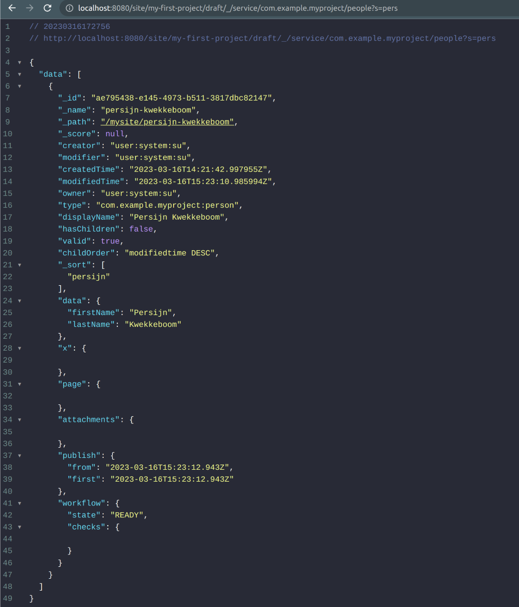

= Build an HTTP service

****
This guide will provide you with the basic knowledge about writing *HTTP services* in Enonic XP.
****

TIP: Additional information on HTTP services can be found in the offical https://developer.enonic.com/docs/xp/stable/runtime/engines/http-service[XP documentation].

== What is an HTTP service
HTTP services are https://developer.enonic.com/docs/xp/stable/framework/http#http-controller[HTTP controllers] that get exposed on urls matching a specific pattern.

In order to create a service, you’ll need to create a Javascript controller and place it under `src/main/resources/services/<service-name>/<service-name>.js`

NOTE: JS controllers should return a specific https://developer.enonic.com/docs/xp/stable/framework/http#http-response[response object].

== Url pattern and context
This is the url pattern in which the service controller will get exposed: `**/_/service/<appname>/<servicename>`

That means that the same service can be invoked in multiple locations:

. `domain.com/_/service/<appname>/<servicename>`
. `domain.com/some/path/_/service/<appname>/<servicename>`
. …

The url you choose to call your service on will *define the context of the call*. For example, depending on the chosen url, you'll get your service running under different projects and/or branches:

. `.../site/my-first-project/draft/_/service/<appname>/<servicename>`
. `.../site/my-first-project/master/_/service/<appname>/<servicename>`
. `.../site/my-second-project/draft/_/service/<appname>/<servicename>`

In the examples above, the first will run on `my-first-project` in the `draft` branch. The second will run on the same project, but in the `master` branch. Finally, the last one will run the `my-second-project` in the `draft` branch.

NOTE: https://developer.enonic.com/docs/xp/stable/api/lib-context[lib context] can be used inside the service controller to ensure a specific context of the call.

== Access restriction
It is also possible to restrict access to a service based on user roles. 

This can be done without custom coding, you just need to add a `<service-name>.xml` file in your service folder with the following structure:

[source,XML]
----
<!-- src/main/resources/services/<service-name>.xml -->
<service>
   <allow>
       <principal>role:system.admin</principal>
       <principal>role:myapp.myrole</principal>
   </allow>
</service>
----

== Generating a valid url
Instead of manually writing a valid service url to call it in your application, Enonic's Portal JS API provides https://developer.enonic.com/docs/xp/stable/api/lib-portal#serviceurl[serviceUrl] method to generate a valid url pointing to a service.

NOTE: The `serviceUrl`` function will mount a url to a service based on the context of where it was called.

== Example of a service
Now that we know what services are, let's build our own.

Our goal is to create a service that returns a JSON with data from a specific content type based on parameters provided by a service url.

. Start by creating a very simple *Person* content type:
+
[source,XML]
----
include::../src/main/resources/site/content-types/person/person.xml[]
----
+
For sake of simplicity, our service will expect a *GET* HTTP request with some specific (but not required) query parameters. 

. Since we’d like to fetch the person content type, it makes sense to call our service something like `people` or `getPeople`. Let’s stick with *people*, therefore create a JS file called `src/main/resources/services/people/people.js` with the following code:
+
[source,Javascript]
----
exports.get = function (request) {};
----

. Let’s now define our query parameters:

.. `s` will be a string parameter to look for person's *firstName* or *lastName* (default: empty string)
.. `l` will be a parameter to *limit the number of results* (default: 5)

. Now that we've defined parameters and values, let’s investigate what is returned on the request parameter of the *GET* handler function. To do that, update the service code to:
+
[source,Javascript]
----
exports.get = function (request) {
   log.info(JSON.stringify(request, null, 4));
};

----

+
Then build and deploy your application. 

+
To call your `people` service, access the following url changing `<appname>` to the name of your app: http://localhost:8080/_/service/<appname>/people?s=my-search-term&l=10

+
NOTE: The name of your app can be located at `gradle.properties` file. It'll be the `appName` config.

. After visiting the url in your preferred browser, check the server logs. You'll notice that query paramters are on `request.params`

+
NOTE: A full description of the request object can be found https://developer.enonic.com/docs/xp/stable/framework/http#http-request[here].

. Finally, let's properly code the service:
+
[source,Javascript]
----
include::../src/main/resources/services/people/people.js[]
----

. Now make sure to create some instances of the person content type. Build and deploy the application. 

. Finally, access the service in the proper context, i.e, using the proper *project name*, *branch* and *app name*:
http://localhost:8080/site/<project-name>/<branch>/_/service/<appname>/people?s=pers
+

+
NOTE: The *project name* can be found in the top left corner of Content Studio. If you haven't set up a new project, it is probably the `default` one. *Branch* will be `draft` or `master`. *App name* was already described before, and is located in `gradle.properties`

NOTE: Depending on the context it is possible to get no data in response. The reason might be that in that context you don't have person content type instances to be queried by content lib.

== Other common use cases
In the previous example we made a service that provided content type data based on query parameters.

This was just a simple example of how services can be used. Here are some other common use cases for HTTP services:

- Provide data for a https://developer.enonic.com/docs/build-a-custom-selector[custom selector]
- Process *POST* requests from forms in an application
- Directly manage content inside repos
- Much more creative scenarios when used together with some https://developer.enonic.com/docs/xp/stable/api[Enonic JS libraries]
